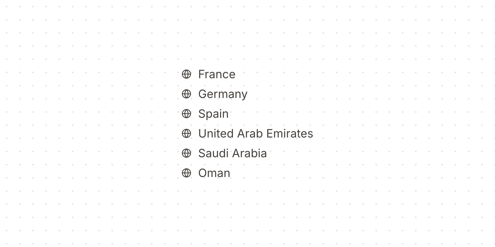
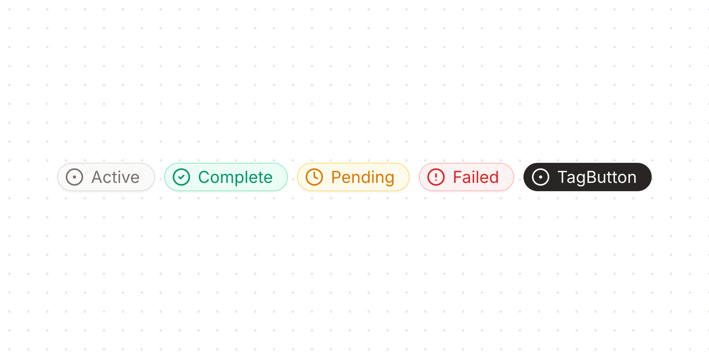
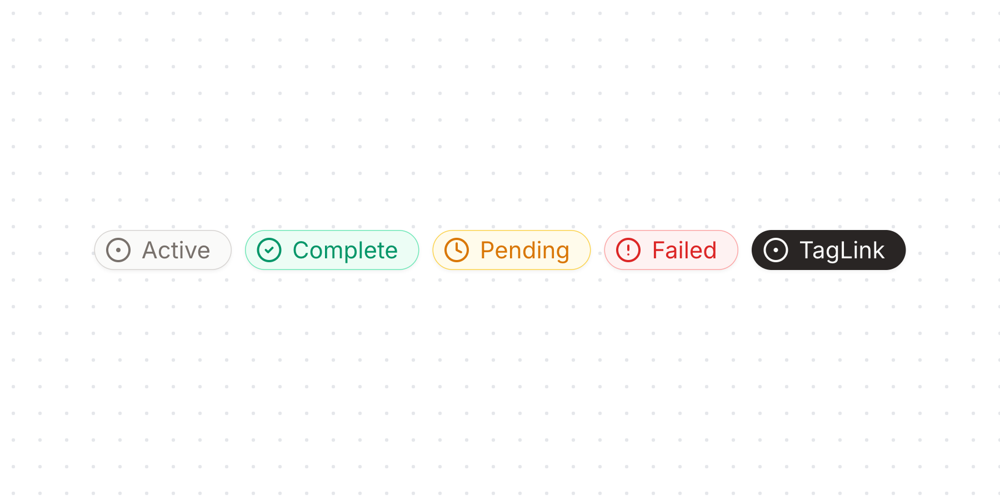

# ui-kit.ai

(Yet another) React component library. This one is designed for use in
data-intensive applications (dashboards, financial applications, etc.).

## Installation

```shell
npm i ui-kit.ai
```

## Components

<div style="display: grid; grid-template-columns: repeat(2, 1fr); gap: 0.5rem;">
<!-- BEGIN-COMPONENT-LINKS -->
  <div style="margin: 2rem 0">
    <h3><a href="https://ui-kit.ai/?path=/docs/components-alert--docs">Alert</a></h3>
    
  </div>
  <div style="margin: 2rem 0">
    <h3><a href="https://ui-kit.ai/?path=/docs/components-button--docs">Button</a></h3>
    
  </div>
  <div style="margin: 2rem 0">
    <h3><a href="https://ui-kit.ai/?path=/docs/components-checkboxgroup--docs">CheckboxGroup</a></h3>
    
  </div>
  <div style="margin: 2rem 0">
    <h3><a href="https://ui-kit.ai/?path=/docs/components-checkbox--docs">Checkbox</a></h3>
    
  </div>
  <div style="margin: 2rem 0">
    <h3><a href="https://ui-kit.ai/?path=/docs/components-combobox--docs">ComboBox</a></h3>
    
  </div>
  <div style="margin: 2rem 0">
    <h3><a href="https://ui-kit.ai/?path=/docs/components-dialog--docs">Dialog</a></h3>
    
  </div>
  <div style="margin: 2rem 0">
    <h3><a href="https://ui-kit.ai/?path=/docs/components-fieldgroup--docs">FieldGroup</a></h3>
    
  </div>
  <div style="margin: 2rem 0">
    <h3><a href="https://ui-kit.ai/?path=/docs/components-form--docs">Form</a></h3>
    
  </div>
  <div style="margin: 2rem 0">
    <h3><a href="https://ui-kit.ai/?path=/docs/components-heading--docs">Heading</a></h3>
    
  </div>
  <div style="margin: 2rem 0">
    <h3><a href="https://ui-kit.ai/?path=/docs/components-input--docs">Input</a></h3>
    
  </div>
  <div style="margin: 2rem 0">
    <h3><a href="https://ui-kit.ai/?path=/docs/components-listbox--docs">ListBox</a></h3>
    
  </div>
  <div style="margin: 2rem 0">
    <h3><a href="https://ui-kit.ai/?path=/docs/components-menu--docs">Menu</a></h3>
    
  </div>
  <div style="margin: 2rem 0">
    <h3><a href="https://ui-kit.ai/?path=/docs/components-popover--docs">Popover</a></h3>
    
  </div>
  <div style="margin: 2rem 0">
    <h3><a href="https://ui-kit.ai/?path=/docs/components-select--docs">Select</a></h3>
    
  </div>
  <div style="margin: 2rem 0">
    <h3><a href="https://ui-kit.ai/?path=/docs/components-tagbutton--docs">TagButton</a></h3>
    
  </div>
  <div style="margin: 2rem 0">
    <h3><a href="https://ui-kit.ai/?path=/docs/components-taglink--docs">TagLink</a></h3>
    
  </div>
  <div style="margin: 2rem 0">
    <h3><a href="https://ui-kit.ai/?path=/docs/components-tag--docs">Tag</a></h3>
    
  </div>
  <div style="margin: 2rem 0">
    <h3><a href="https://ui-kit.ai/?path=/docs/components-textfield--docs">TextField</a></h3>
    
  </div>
  <div style="margin: 2rem 0">
    <h3><a href="https://ui-kit.ai/?path=/docs/components-tooltip--docs">Tooltip</a></h3>
    
  </div>
<!-- END-COMPONENT-LINKS -->
</div>
