# Boondoggle

(Yet another) React component library. This one is designed for use in
data-intensive applications (dashboards, financial applications, etc.).


## Installation

```shell
npm i boondoggle
```

## Documentation

There is a Storybook deployed to <https://boondoggle.design>

## Components

<!-- BEGIN-COMPONENT-SCREENSHOTS -->


### Alert

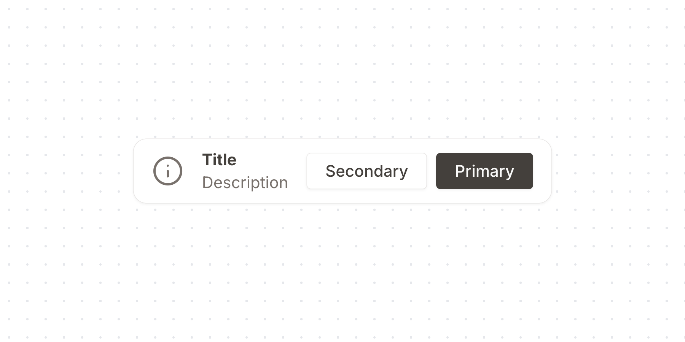


### Button

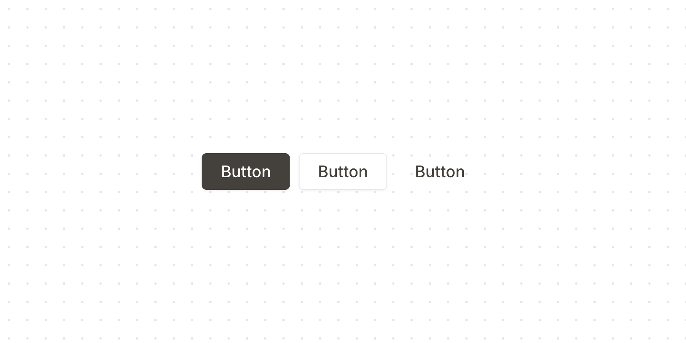

When `isDestructive` is set to `true` the Button will styled in red, to denote a destructive action.
/
    isDestructive?: boolean;
    /**
When `isInverted` is set to `true` light colors are dark, and vice/versa.
/
    isInverted?: boolean;
    /**
When set to `true` the Button will be styled to be square with a fixed
height & width. This should be used in conjunction with passing an icon
component to the `children` prop.
**Note**: If you aren't passing text to the `children` prop, ensure you
are passing an `aria-label` attribute, so the Button is correctly
labelled to assistive technologies.
/
    isIcon?: boolean;
    /**
A decorative node (e.g. an icon) to render on the left side of the
Button. When a node is passed, the padding on the corresponding side is
slightly reduced to maintain visual balance.
/
    slotLeft?: SlotNode;
    /**
A decorative node (e.g. an icon) to render on the right side of the
Button. When a node is passed, the padding on the corresponding side is
slightly reduced to maintain visual balance.
/
    slotRight?: SlotNode;
    /**
- **`primary`**: The main action button. Use this for the most important actions on a page, such as "Submit," "Save," or "Continue."
- **`secondary`**: A less prominent button used for secondary actions, like "Cancel" or "Go Back." It should not compete visually with primary buttons.
- **`tertiary`**: A minimal-styled button for low-emphasis actions. Use this for links, "Learn More" buttons, or actions that don't require strong visual weight.
/
    variant?: "primary" | "secondary" | "tertiary";
};
type ButtonProps = ButtonCommonProps & RACButtonProps;
const ButtonLoadingState = ({
    children,
    isPending,
}: {
    children: React.ReactNode;
    isPending?: boolean;
}) =>
    isPending === true ? (
        <div className="relative">
            <div aria-hidden className="opacity-0">
                {children}
            </div>
            <div className="absolute inset-0 flex items-center justify-center">
                <Loader className="!size-4" />
            </div>
        </div>
    ) : (
        children
    );
/**
A button allows a user to perform an action, with mouse, touch, and
keyboard interactions.
[source code](https://github.com/alex-mcgovern/boondoggle/tree/main/src/components/button)
[react-aria](https://react-spectrum.adobe.com/react-aria/Button.html)
## Usage
```tsx
import { Button } from "boondoggle"
```
```tsx
<Button>Press me</Button>
```


### CheckboxGroup


A checkbox group allows a user to select multiple items from a list of options.
It can be composed with a Label and Description to correctly label the input
to assistive technologies, and provide extra context.
[source code](https://github.com/alex-mcgovern/boondoggle/tree/main/src/components/checkbox-group)
[react-aria](https://react-spectrum.adobe.com/react-aria/CheckboxGroup.html)
## Usage
```tsx
import { Checkbox, CheckboxGroup } from "boondoggle"
```
```tsx
<CheckboxGroup>
    <Checkbox
        value="item-1"
        label="Item 1"
    />
    <Checkbox
        value="item-2"
        label="Item 2"
    />
</CheckboxGroup>
```


### Checkbox

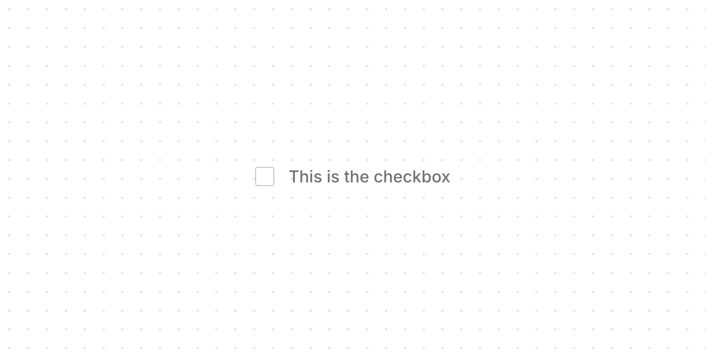


### ComboBox

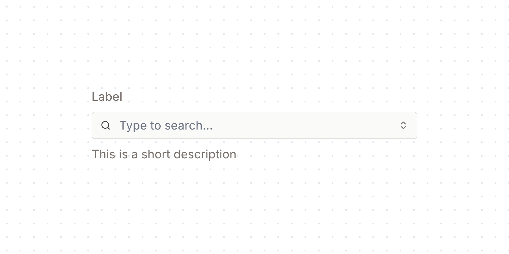

A button that triggers the ComboBox Popover. Props such as onPress and
isDisabled will be set by the ComboBox.
/
export function ComboBoxButton(
    props: Omit<
        ComponentProps<typeof FieldButton>,
        "onPress" | "isDisabled" | "children"
    >,
) {
    return (
        <FieldButton {...props}>
            <IconChevronsUpDown aria-hidden />
        </FieldButton>
    );
}
/**
A button that clears the selected key from the ComboBox. Only visible when
the ComboBox has a selected key. Props such as onPress and isDisabled will be
set by the ComboBox.
/
export function ComboBoxClearButton(
    props: Omit<
        ComponentProps<typeof FieldButton>,
        "onPress" | "isDisabled" | "children" | "slot"
    >,
) {
    const state = useContext(ComboBoxStateContext);
    const isEmpty =
        state?.inputValue == null ||
        state.inputValue === "";
    return (
        <FieldButton
            {...props}
            aria-label="Clear"
            isDisabled={isEmpty}
            onPress={() => {
                state?.setInputValue("");
                state?.setSelectedKey(null);
            }}
            className={(renderProps) =>
                twMerge(
                    "transition-opacity",
                    isEmpty
                        ? "invisible hidden opacity-0"
                        : "opacity-100",
                    typeof props.className === "function"
                        ? props.className(renderProps)
                        : props.className,
                )
            }
            slot={null} // Don't inherit default Button behavior from ComboBox.
        >
            <IconX aria-hidden className="size-4" />
        </FieldButton>
    );
}
/**
A group that holds a ComboBoxInput and the related button controls.
Responsible for setting a ref used to measure the input and size the Popover
correctly.
/
export function ComboBoxFieldGroup(
    props: ComponentProps<typeof FieldGroup>,
) {
    const ref = useContext(ComboBoxRefContext);
    if (!ref)
        throw Error(
            "ComboBoxFieldGroup must be used within a ComboBox",
        );
    return <FieldGroup {...props} ref={ref} />;
}
/**
An input that is used to interact with a ComboBox. Is customized to
toggle the ComboBox on click.


### Dialog

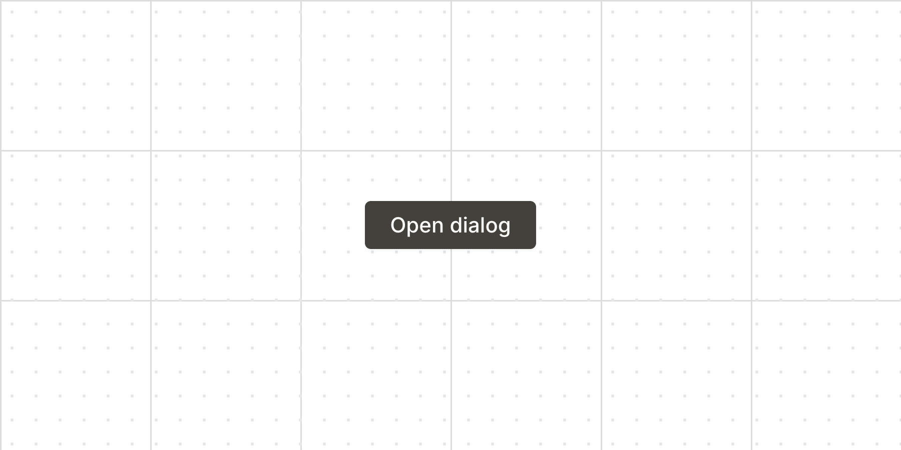

A dialog is an overlay shown above other content in an application.
[source code](https://github.com/alex-mcgovern/boondoggle/tree/main/src/components/dialog.tsx)
[react aria](https://react-spectrum.adobe.com/react-aria/Dialog.html)
## Usage
```tsx
import {
    Dialog,
    DialogCloseButton,
    DialogContent,
    DialogFooter,
    DialogHeader,
    DialogTitle,
    DialogTrigger,
} from "boondoggle";
```
```tsx
<Dialog>
    <DialogHeader>
        <DialogTitle>
            // accessible name for the dialog
        </DialogTitle>
        <DialogCloseButton />
    </DialogHeader>
    <DialogContent>
        // inner, scrollable content
    </DialogContent>
    <DialogFooter>
        // content pinned to bottom, e.g. action buttons
    </DialogFooter>
</Dialog>
```
/
export function Dialog({
    width = "sm",
    ...props
}: RACDialogProps & { width?: "lg" | "md" | "sm" }) {
    return (
        <DialogModalOverlay isDismissable>
            <DialogModal isDismissable>
                <RACDialog
                    {...props}
                    className={twMerge(
                        dialogStyles({ width }),
                        props.className,
                    )}
                />
            </DialogModal>
        </DialogModalOverlay>
    );
}
/**
A button to close the dialog.
@see https://react-spectrum.adobe.com/react-aria/Dialog.html#state
/
export function DialogCloseButton(
    props: Omit<
        ComponentProps<typeof Button>,
        "aria-label" | "name" | "type" | "variant"
    >,
) {
    const { close } =
        useContext(RACOverlayTriggerStateContext) ?? {};
    return (
        <Button
            {...props}
            aria-label="Close"
            className={(rp) =>
                twMerge(
                    "-mx-3",
                    typeof props.className === "function"
                        ? props.className(rp)
                        : props.className,
                )
            }
            isIcon
            name="close"
            onPress={(e) => {
                props.onPress?.(e);
                close?.();
            }}
            type="button"
            variant="tertiary"
        >
            <IconX />
        </Button>
    );
}
/**
Wrapper to render the dialog header.
/
export function DialogHeader(
    props: HTMLProps<HTMLElement>,
) {
    return (
        <header
            {...props}
            className={twMerge(
                "h-10",
                "px-4",
                "flex shrink-0 items-center justify-between gap-4",
                "border-b-muted-200 border-b",
                props.className,
            )}
        />
    );
}
/**
Wraps a {@link Heading} component and adds the `title` slot which accessibly labels
the dialog.
@note If a dialog does not have a {@link DialogTitle}, an `aria-label` or
`aria-labelledby` prop must be passed instead to identify the element to
assistive technology.
/
export function DialogTitle({
    children,
    ...props
}: Omit<ComponentProps<typeof Heading>, "level" | "slot">) {
    return (
        <Heading
            {...props}
            className={twMerge(
                "mb-0 truncate text-sm",
                props.className,
            )}
            level={3}
            slot="title"
        >
            {children}
        </Heading>
    );
}
/**
A DialogTrigger opens a dialog when a trigger element is pressed.
/
export function DialogTrigger(
    props: RACDialogTriggerProps,
) {
    return <RACDialogTrigger {...props} />;
}
/**
Wrapper to render scrollable content within the dialog.


### FieldGroup

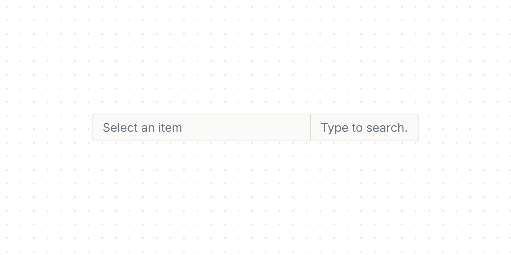

A group represents a set of related UI controls, and supports interactive
states for styling.
@see https://react-spectrum.adobe.com/react-aria/Group.html


### Form

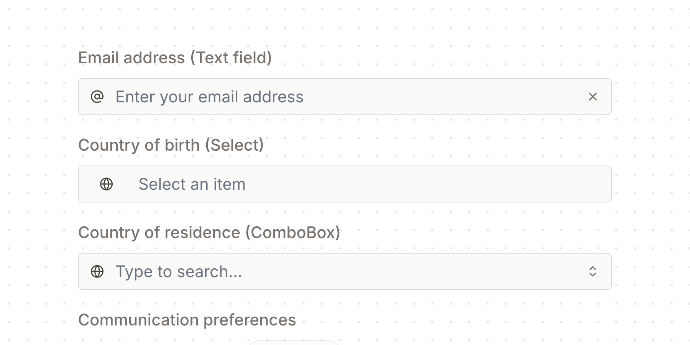


### Heading

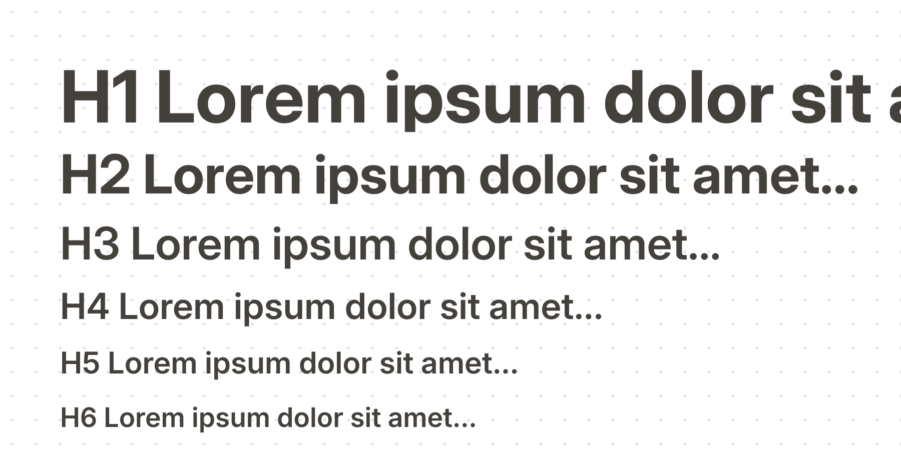


### Input

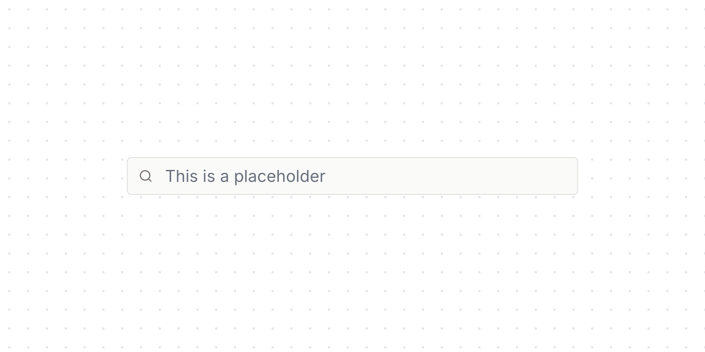

An Input is a primitive component used when composing fields, (e.g.
TextField, SearchField, NumberField).
[source code](https://github.com/alex-mcgovern/boondoggle/tree/main/src/components/description)
## Usage
```tsx
import { Input } from "boondoggle"
```
```tsx
<Input placeholder="Type something..." />
```


### Menu

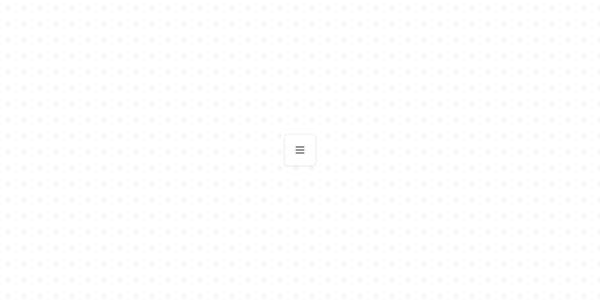


### Popover

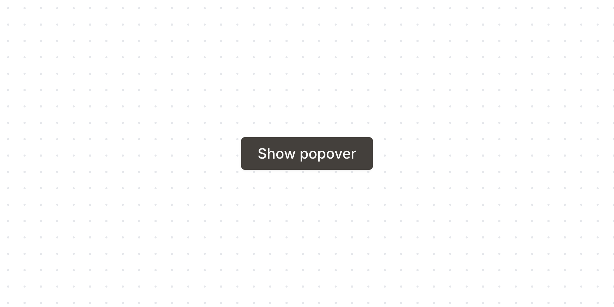


### Select

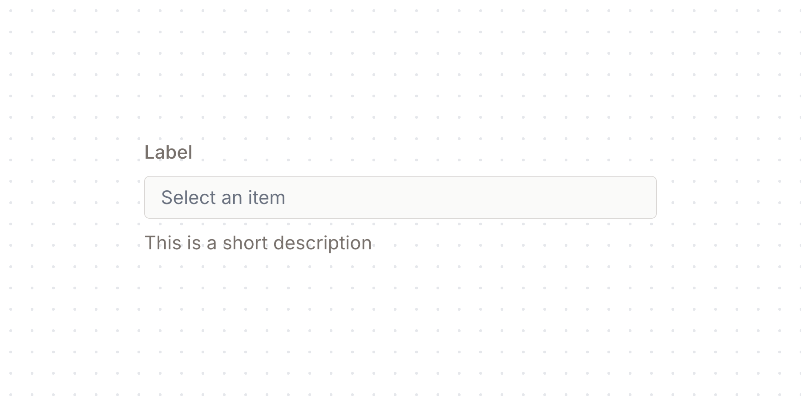

A select displays a collapsible list of options and allows a user to select one of them.
[source code](https://github.com/alex-mcgovern/boondoggle/tree/main/src/components/tooltip)
[react-aria](https://react-spectrum.adobe.com/react-aria/Tooltip.html)
## Usage
```tsx
import {
    Select,
    SelectButton
} from "boondoggle"
```
```tsx
<Select items={[{ id: "item-1", textValue: "Item 1"}]}>
    <SelectButton />
</Select>
```


### Tag

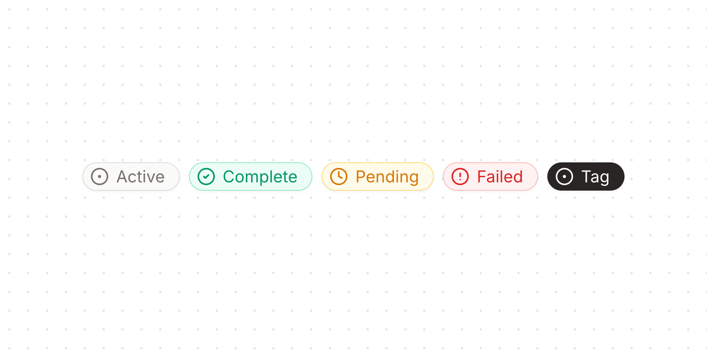

Whether the tag is a Button.
/
    isButton?: boolean;
    /**
Whether the tag is a Link.
/
    isLink?: boolean;
    /**
The visual appearance of the tag.
/
    variant?: Variant;
    /**
Adds an optional dashed border to the tag.
/
    isDashed?: boolean;
    /**
A decorative node (e.g. an icon) to render on the left side of the
Tag. When a node is passed, the padding on the corresponding side is
slightly reduced to maintain visual balance.
/
    slotLeft?: SlotNode;
    /**
A decorative node (e.g. an icon) to render on the right side of the
Tag. When a node is passed, the padding on the corresponding side is
slightly reduced to maintain visual balance.
/
    slotRight?: SlotNode;
};
const tagStyles = tv({
    extend: focusRing,
    base: [
        "h-6 min-w-6",
        "text-center text-sm font-normal",
        "shadow-sm",
        "inline-flex shrink-0 items-center justify-center gap-1.5",
        "rounded-full border",
        "[&_svg]:size-4 [&_svg]:shrink-0",
        // padding
        "px-3 py-1.5",
        "[&:has([data-slot=slot-left])]:pl-1.5",
        "[&:has([data-slot=slot-right])]:pr-1.5",
        // color vars
        "[--bg:theme(colors.muted.50)]",
        "[--bg-hover:theme(colors.muted.100)]",
        "[--bg-pressed:theme(colors.muted.200)]",
        "[--border:theme(colors.muted.300)]",
        "[--text:theme(colors.muted.500)]",
        // assignment
        "border-[--border] bg-[--bg] text-[--text]",
        // interactivity
        "[&:is(a,button)]:hover:bg-[--bg-hover]",
        "[&:is(a,button)]:pressed:bg-[--bg-pressed]",
    ],
    defaultVariants: {
        variant: "default",
        isDashed: false,
    },
    variants: {
        isDashed: {
            true: "border-dashed",
            false: "border-solid",
        },
        variant: {
            default: [""],
            green: [
                "[--bg:theme(colors.green.50)]",
                "[--bg-hover:theme(colors.green.100)]",
                "[--bg-pressed:theme(colors.green.200)]",
                "[--border:theme(colors.green.300)]",
                "[--text:theme(colors.green.600)]",
            ],
            red: [
                "[--bg:theme(colors.red.50)]",
                "[--bg-hover:theme(colors.red.100)]",
                "[--bg-pressed:theme(colors.red.200)]",
                "[--border:theme(colors.red.300)]",
                "[--text:theme(colors.red.600)]",
            ],
            yellow: [
                "[--bg:theme(colors.yellow.50)]",
                "[--bg-hover:theme(colors.yellow.100)]",
                "[--bg-pressed:theme(colors.yellow.200)]",
                "[--border:theme(colors.yellow.300)]",
                "[--text:theme(colors.yellow.600)]",
            ],
            inverted: [
                "border-muted-800 bg-muted-800 text-muted-50",
                "[&:is(a,button)]:hover:border-muted-800",
                "[&:is(a,button)]:hover:bg-muted-800",
                "[&:is(a,button)]:pressed:border-muted-700",
                "[&:is(a,button)]:pressed:bg-muted-700",
            ],
        },
    },
});
/**
Tag component


### TextField

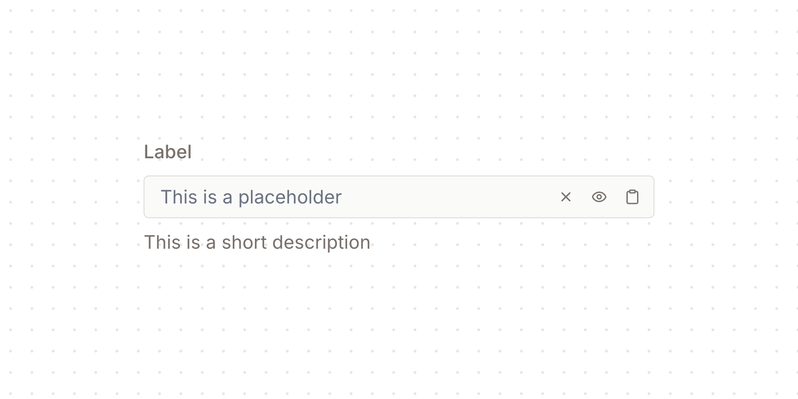


### Tooltip

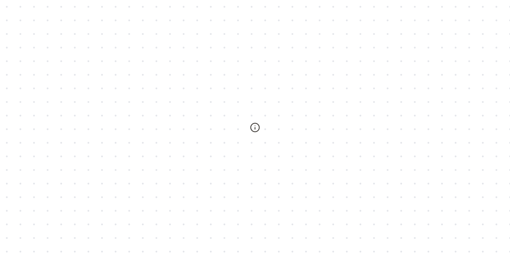

A wrapper around an element that can receive focus that controls the tooltip.
/
export function TooltipTrigger({
    delay = 0,
    ...props
}: RACTooltipTriggerProps) {
    return <RACTooltipTrigger {...props} delay={delay} />;
}
/**
A button with an info icon that triggers a tooltip.

<!-- END-COMPONENT-SCREENSHOTS -->
</div>
